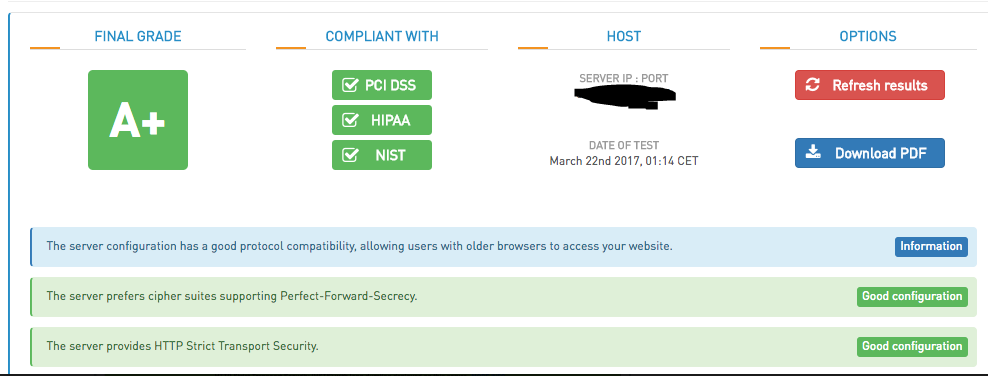
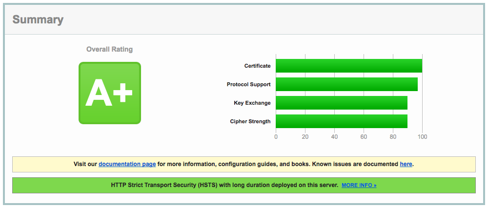

Nginx Compliance Config
=======================

Table of Contents
-----------------
1. [Overview](#overview)
2. [Reference Platform Requirements](#reference-platform-requirements)
3. [Website SSL Config/Vulnerability Scanners](#website-ssl-configvulnerability-scanners)
  * [SSL Server Security Test](#high-tech-bridge---ssl-server-security-test)
  * [Web Server Security Test](#high-tech-bridge---web-server-security-test)
  * [SSL Labs](#ssl-labs)
  * [DigiCert](#digicert)
4. [SSL Cert/Pem File Notes](#ssl-certpem-file-notes)
  * [SSL CRT](#ssl_certificate)
  * [Intermediary Chain Creation Help](#intermediary-chain-creation-help)
  * [SSL Private Key](#ssl_certificate_key)
  * [Diffie-Hellman](#ssl_dhparam)
  * [SSL Trusted Cert](#ssl_trusted_certificate)
  * [Full Chain Creation Help](#full-chain-creation-help)
5. [OSCP Testing](#oscp-testing)

Overview
--------

Example configuration of Nginx for security compliance.

* PCI-DSS
* HIPPA
* NIST
* Common best practices

Reference Platform Requirements
------------------------------

* Nginx ~1.10 (v1.3+ required)
* CentOS7 _(This shouldn't matter)_

Website SSL Config/Vulnerability Scanners
----------------------------------------

### High-tech Bridge - SSL Server Security Test

>[https://www.htbridge.com/ssl]

* A+
* PCI-DSS
* HIPPA
* NIST compliance

### High-tech Bridge - Web Server Security Test

>[https://www.htbridge.com/websec]

* A
* HTTP/1.1 and HTTP2
* Webserver does not send detailed information about its version
* `STRICT-TRANSPORT-SECURITY` - The header is properly set.
* `PUBLIC-KEY-PINS` - The header was not sent by the server.
* `X-FRAME-OPTIONS` - The header is properly set.
* `X-XSS-PROTECTION` - The header is properly set.
* `X-CONTENT-TYPE-OPTIONS` - The header is properly set.
* `CONTENT-SECURITY-POLICY` - Content-Security Policy is enforced. _Some directives have values that are too permissive, like wildcards._

### SSL Labs

>[https://globalsign.ssllabs.com]

* A+
* `Certificate`: 100/100
* `Support Protocol`: 98/100
* `Key Exchange`: 90/100
* `Cipher Strength`: 90/100
* HTTP Strict Transport Security (HSTS) with long duration deployed on this server.
* TLS v1.1 + v1.2
* Secure Renegotiation  Supported
* Secure Client-Initiated Renegotiation No
* Insecure Client-Initiated Renegotiation No
* POODLE (SSLv3)  No, SSL 3 not supported
* POODLE (TLS)  No
* Downgrade attack prevention Yes, TLS_FALLBACK_SCSV supported
* SSL/TLS compression No
* RC4 No
* Heartbeat (extension) Yes
* Heartbleed (vulnerability)  No
* Forward Secrecy Yes
* ALPN  No
* NPN Yes   h2 http/1.1
* Session resumption (caching)  Yes
* Session resumption (tickets)  Yes
* OCSP stapling Yes
* Strict Transport Security (HSTS)  Yes 
* Incorrect SNI alerts  No
* Uses common DH primes No
* DH public server param (Ys) reuse No
* HTTP server signature nginx

### DigiCert

> [https://www.digicert.com/help/]

* All green checks
* OCSP Staple:  Good
* OCSP Origin:  Good
* CRL Status: Good

SSL Cert/Pem File Notes
-----------------------

## ssl_certificate

Single CRT files from certificate authorities cannot be used. In this configuration we need a PEM format x509 certificate file. This includes the signed CRT and all intermediary CA certificates _but not the External Root CA certificate_. Adding the root ca cert will result in an error.

Creation example if you have the SSL chain file already:
~~~
cat www.example.com.crt COMODORSADomainValidationSecureServerCA.crt COMODORSAAddTrustCA.crt > /etc/ssl/ssl-bundle.pem
~~~

### Intermediary Chain Creation Help

[https://whatsmychaincert.com/] -> Generate the Correct Chain -> paste in your signed CRT (public key) -> ensure _Include Root Certificate_ box is *not* checked -> click Generate Chain. This is supposed to create a PEM chain file with all intermediary CA certs. With this to create the ssl_certificate you can just `cat www.example.com.crt example.com.chain.crt > /etc/ssl/ssl-bundle.pem`

## ssl_certificate_key

This is simply the private key file you used to create the CSR request before sending it off to the CA to be signed.

Creation Example:
~~~
openssl genrsa -out www.example.com.key 2048
~~~

## ssl_dhparam

The Diffie-Hellman algorithm provides the capability for two communicating parties to agree upon a shared secret between them. A unique 2048+ bit DH secret is required and can be easily created with openssl.

Creation Example:
~~~
openssl dsaparam -out /etc/ssl/dsaparam.pem 4096 # A 4096 bit key will be considered strong for some time.
~~~

## ssl_trusted_certificate

The trusted certificate file is used internally by Nginx and it required for OCSP. The PEM format file is the signed CRT, combined with all intermediary CA certs, combined with the final external CA root cert. We use the previously created ssl-bundle.pem file and combine it with the CA provided CA root authority cert. If they don't provide it google is your friend. 

Creation Example if you have the full chain already:
~~~
cat /etc/ssl/ssl-bundle.pem /etc/ssl/www.example.com.externalcaroot > /etc/ssl/ca.trust
~~~

### Full Chain Creation Help

[https://whatsmychaincert.com/] -> Generate the Correct Chain -> paste in your signed CRT (public key) -> check *Include Root Certificate* box -> click Generate Chain. This creates a PEM chain file with root cert for use with OCSP. After you download the generated CRT file you can just `cat www.example.com.crt example.com.chain+root.crt > /etc/ssl/ca.trust`

OSCP Testing
------------

OCSP compliance can be split into 2 parts. Nginx configuration settings and a properly created ssl_trusted_certificate PEM file. If you have properly configured Nginx config but have a misconfigured ssl_trusted_certificate PEM file, you will have positive `opensssl s_client` test results and fail complete online *OCSP* validation scans. For help tracking down intermediary and root certs use: `openssl x509 -in /etc/ssl/file.crt -text -noout`

Nginx Configuration Settings
~~~
    ssl_stapling on;
    ssl_stapling_verify on;
    # Google public DNS servers used in example
    resolver 8.8.8.8 8.8.4.4 valid=300s;
    resolver_timeout 2s;
    ssl_trusted_certificate "/etc/ssl/ca.trust";
~~~

openssl Test command: `openssl s_client -connect 127.0.0.1:443 -tls1_2 -tlsextdebug -status`

openssl Positive Test Result Example
~~~
OCSP response: 
======================================
OCSP Response Data:
    OCSP Response Status: successful (0x0)
    Response Type: Basic OCSP Response
    Version: 1 (0x0)
    Responder Id: 2033CDB761Fxxxxxxxxxxxxxxxxxxxxxxxxxx
    Produced At: Mar 20 20:00:04 2017 GMT
    Responses:
    Certificate ID:
      Hash Algorithm: sha1
      Issuer Name Hash: BCA4275C75FEFF061Exxxxxxxxxxxxxxxxxxxxxxx
      Issuer Key Hash: 2033CDwwwwwwwwwwwwwwwwwwwwwwwwwww
      Serial Number: yyyyyyyyyyyyyyyyyyyyyyyyyyyyyy
    Cert Status: good
    This Update: Mar 20 20:00:04 2017 GMT
    Next Update: Mar 27 20:00:04 2017 GMT

    Signature Algorithm: sha256WithRSAEncryption
         3d:44:8e:8d:a6:d9:cd:7f:ae:99:de:de:af:25:f1:90:82:9b:
         5c:a9:17:05:23:cb:18:28:1e:97:63:2a:02:10:b1:fb:33:af:
         12:06:43:86:87:b2:64:1a:6a:93:14:c8:4c:ac:96:96:e5:49:
         82:26:17:f9:7e:79:a3:bf:51:97:a8:e3:1e:1b:b5:9b:88:d7:
         91:78:4d:a8:ee:dd:6a:b8:94:ed:13:8a:2b:68:a7:7b:2d:43:
         ab:bc:91:de:d3:42:e3:bb:26:14:de:a4:8f:95:ba:a6:af:f0:
         0b:bb:91:f3:29:97:da:2e:a5:4f:c5:06:7e:96:5f:3e:09:e6:
         1a:7c:1f:4e:16:f3:a7:0d:99:cd:e4:9d:99:99:dd:b4:61:ba:
         14:4e:d3:cc:50:dd:06:85:3f:1e:42:c6:b2:94:af:35:ff:20:
         db:d6:eb:a9:0f:b3:2f:c7:a9:2c:65:7a:4b:ad:95:2c:cd:6f:
         05:73:88:f1:7b:a1:b0:ad:75:d3:32:b8:04:a4:41:c4:f4:5c:
         73:ce:db:e9:06:52:d3:ab:3a:f0:ba:e7:e4:2a:73:b6:62:03:
         2b:11:8d:df:d5:1e:6b:21:d7:56:a4:37:69:05:f3:78:12:18:
         e8:22:36:3b:51:58:61:c0:6d:ae:ba:7f:ff:65:49:ba:2d:f0:
         5f:1b:9f:32
======================================
~~~
